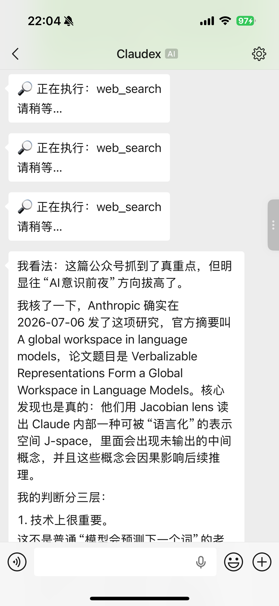
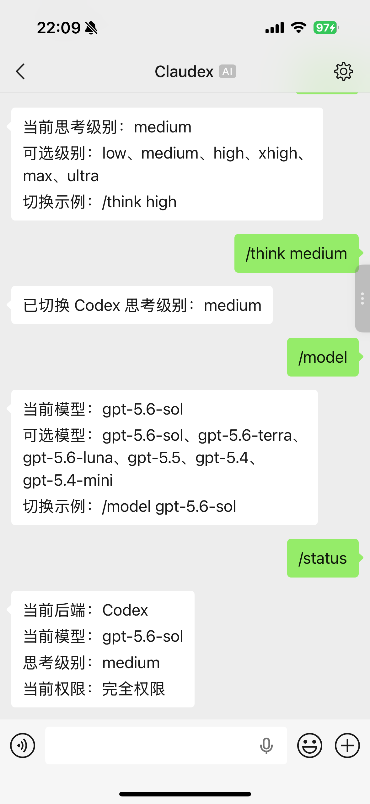
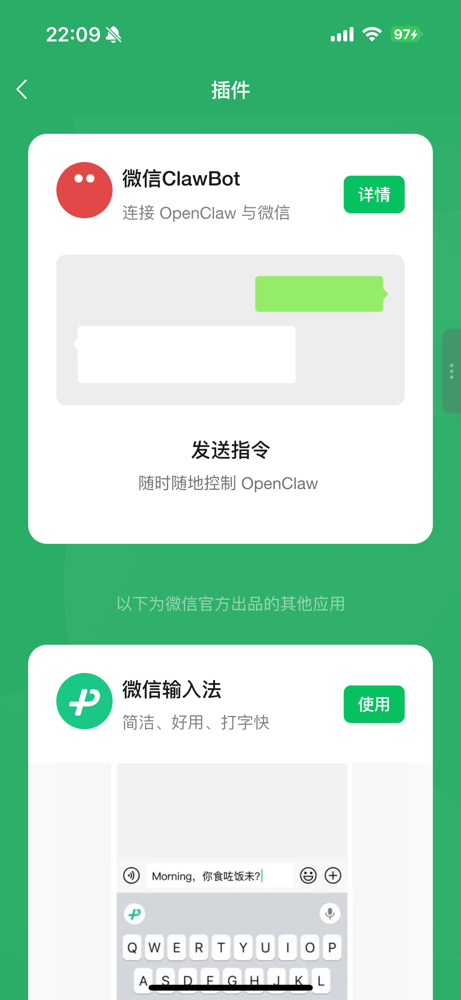
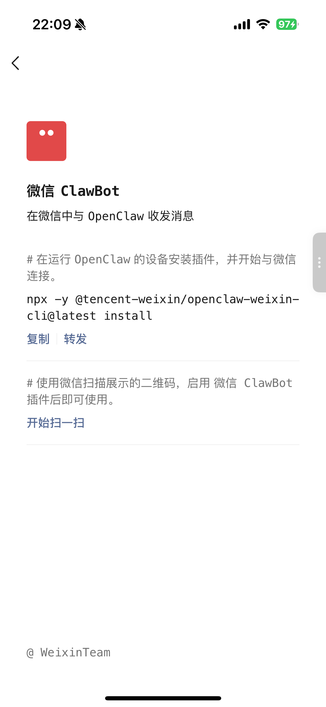

# WeClaudex

<p align="center">
  
</p>

[English](README.en.md) | 简体中文

[](https://github.com/chenshize/weclaudex/releases/latest)
[](https://www.npmjs.com/package/weclaudex)
[](https://github.com/chenshize/weclaudex/actions/workflows/ci.yml)
[](package.json)
[](LICENSE)

**在微信中使用本机的 Claude Code 和 Codex。** 在手机上发送需求、截图、文件或语音消息，让 Agent 在你自己的电脑和项目目录里工作；随时切换后端、模型、思考级别、工作区和权限，并把结果与产物安全地发回微信。

真实 Codex thread / Claude Code session 可以跨切换和重启继续；任务、回复和待发送文件能够持久恢复。Agent 产物不会自动外发，从微信发送文件必须由你明确执行 `/send`。WeClaudex 复用本机已登录的 CLI，无需为桥接单独配置模型 API Key。

## 核心能力

- **远程任务控制**：通过微信提交任务、查看进度、停止执行、重试异常任务并补发结果。
- **双 Agent 单入口**：用 `/codex` 与 `/claude-code` 切换后端，分别保留各自的原生会话与上下文。
- **多模态输入**：文本、截图、文件、微信语音转写和视频可以进入同一任务，连续发送的上下文会自动合并。
- **持久恢复**：桥重启或网络波动后，未开始的任务、已完成的回复和待发送文件按各自安全边界恢复。
- **跨设备接力**：查看桥保存的原生 Session，并生成可在电脑终端直接恢复同一会话的命令。
- **后台常驻**：macOS launchd 与 Linux systemd 用户服务负责开机启动、重启、状态和日志。
- **微信微监督**：用安静、标准或详细通知控制工具进度和长任务心跳；原生 Agent 请求输入时仍会通知。
- **双 Agent 接力**：用 `/review` 让另一 Agent 只读复核当前工作区，或用 `/handoff` 把后续实现显式交给它；无需复制聊天记录。
- **分级安全控制**：发送者白名单、安全工作区、`read-only / workspace / full`、显式 `/send` 和敏感路径拦截共同约束远程操作范围。

## 功能展示

<p align="center">
  
  
</p>

## 快速开始

### 环境要求

- Node.js 22+
- 已安装并登录 [Codex CLI](https://github.com/openai/codex#quickstart) 和/或 [Claude Code](https://docs.anthropic.com/en/docs/claude-code/getting-started)
- 微信中能够看到“插件”里的“微信 ClawBot”入口
- 一个专门供 Agent 工作的项目目录

只安装一个 Agent 也可以，未安装的另一个 CLI 会在调用或 `/doctor` 时显示不可用。

当前 CI 覆盖 Ubuntu/Linux 与 macOS。Windows 兼容路径已经实现，但尚未纳入 CI；Windows 用户建议优先在 WSL 或 Git Bash 中验证。

### 安装与启动

```bash
npm install -g weclaudex
weclaudex init
weclaudex login
cd "/absolute/path/to/project"
weclaudex doctor
weclaudex service install
```

扫码连接后，在微信中发送 `/status`，再发送第一个开发任务。若不希望安装后台服务，也可以继续使用前台命令 `weclaudex run`。

> [!IMPORTANT]
> WeClaudex 会以你的本地用户身份启动 Coding Agent。请使用专用工作区并保留默认的 `workspace` access；发送者白名单只能限制谁能触发桥接，不能让危险指令本身变安全。仅在完全理解风险时启用 `/access full` 或 `WECHAT_BRIDGE_ALLOW_ALL=1`。

## 接入微信 ClawBot

微信 ClawBot 是当前接入微信的必要入口。如果你的微信里没有“插件”或“微信 ClawBot”，目前无法通过 WeClaudex 完成接入。

1. 在微信中打开“插件”页面，找到“微信 ClawBot”并进入详情。

   <p align="center">
     
   </p>

2. 在运行桥接服务的电脑上执行：

```bash
weclaudex login
```

   本项目不需要执行 ClawBot 详情页里展示的 OpenClaw 安装命令。

3. 在 ClawBot 详情页点击“开始扫一扫”，扫描终端显示的二维码并确认连接。

   <p align="center">
     
   </p>

4. 登录完成后，启动桥接：

```bash
cd "/absolute/path/to/project"
weclaudex service install
```

默认只处理扫码登录返回的微信 `userId` 发来的消息。其他发送者必须显式加入 `WECHAT_BRIDGE_ALLOW_FROM`。

## 典型工作流

```text
/claude-code
分析这张报错截图并给出修复建议

/review codex 错误根因、回归风险和测试缺口

/handoff codex 根据复核结果实施修复并运行测试

/status
/artifacts
/send 1
```

Claude Code 与 Codex 拥有彼此独立的原生会话，不会自动共享对方的聊天上下文。切换后请在任务中保留必要信息。

## 它如何工作

WeClaudex 不是另一个 Agent。它负责把微信消息交给你电脑上已经登录的 Codex 或 Claude Code CLI，并在两端之间管理会话、任务和回复。WeClaudex 本身不提供模型服务，也不会把项目复制到自己的中间服务器；代码如何被模型服务处理，仍取决于两个 CLI 各自的行为和配置。

```text
微信消息
   ↓
本地任务队列（先保存，再执行）
   ↓
Agent Lane（找到这次任务对应的独立会话）
   ↓
本机 Codex / Claude Code CLI
   ↓
本地回复队列（发送失败时保留）
   ↓
微信回复
```

这里有四个后文会用到的概念：

- **Agent Lane**：一条独立的 Agent 会话。它把某位微信发送者、所选 Agent、项目目录和权限模式绑定在一起，保存原生 Codex thread 或 Claude Code session；切走再切回来仍能接着聊。
- **工作区与权限**：工作区决定 Agent 在哪个项目目录里工作，`access` 决定它可以只读、修改工作区，还是获得完全权限。
- **inbox / outbox**：inbox 是本地任务队列，outbox 是本地回复队列。它们让桥在重启或网络中断后知道哪些任务还没开始、哪些结果还没发出。
- **产物**：Agent 新建或修改的文件。产物不会自动发到微信，必须先用 `/artifacts` 查看，再用 `/send` 明确选择。

### 会话如何隔离与恢复

可以把 Agent Lane 理解为 WeClaudex 为一种执行环境保存的“会话槽位”。不同发送者、Agent、项目或权限不会挤进同一段上下文：

```text
微信账号 × 发送者 × Agent × 项目目录 × 权限模式 = 一条 Agent Lane
```

Codex Lane 保存真实 `threadId`，Claude Code Lane 保存真实 `sessionId`。切换 Agent、项目或权限会进入另一条 Lane，回到原组合时会继续原会话；`/new` 只重置当前 Lane，不影响其他会话。

模型和思考级别不是 Lane 身份的一部分，但每条任务入队时都会保存当时的 Agent、工作区、权限、模型和思考级别。因此，任务排队后再修改设置只影响之后的消息，不会悄悄改变已经排队的工作。关于会话失效处理、状态文件和恢复边界的实现细节，请参阅 [架构文档](docs/ARCHITECTURE.md)。

## 从源码运行

```bash
git clone https://github.com/chenshize/weclaudex.git
cd weclaudex
npm ci
npm run check
npm run login
WECHAT_BRIDGE_CWD=/absolute/path/to/project npm run run
```

源码方式适合审阅代码、运行测试和参与贡献；普通使用优先选择 npm 全局安装。

## 运行

```bash
cd "/absolute/path/to/project"
weclaudex run
```

源码目录中对应的命令是 `npm run run`。

新安装的凭据和状态默认保存在：

```text
~/.weclaudex
```

可以用 `WECHAT_BRIDGE_STATE_DIR` 指定其他目录。

## 微信指令

| 指令 | 作用 |
| --- | --- |
| `/codex` | 切换到 Codex；存在匹配 Lane 时继续原 thread |
| `/claude-code` | 切换到 Claude Code；存在匹配 Lane 时继续原 session |
| `/status` | 查看 Agent、模型、思考级别、access、工作区、Lane、入站队列、待补发消息和最近产物 |
| `/model` | 查看当前 Agent 的模型和可选项 |
| `/model <name>` | 切换当前 Agent 的模型 |
| `/think` | 查看当前 Agent 的思考级别和可选项 |
| `/think <level>` | 切换当前 Agent 的思考级别 |
| `/new` | 停止当前任务、清空排队消息并为当前 Lane 开启新会话 |
| `/reset` | `/new` 的别名 |
| `/stop` | 停止当前任务，取消尚未执行的入站任务和仍未被 outbox 接纳的完成回复；不会清除当前 Lane，也不会删除已经耐久接纳的待补发结果或文件 |
| `/queue` | 查看当前任务、等待消息、异常中断和待补发消息数量 |
| `/tasks` | 查看最近持久任务及其短编号；`/jobs` 是兼容别名 |
| `/task <编号>` | 查看任务状态、Agent、工作区、权限、模型和最近错误 |
| `/retry` | 按接收顺序重新提交当前发送者的 `failed` / `interrupted` 任务；已入队任务保留冻结配置 |
| `/sessions` | 查看当前发送者保存的原生 Codex thread 与 Claude Code session |
| `/resume-command` | 获取当前 Lane 的终端恢复命令；避免终端和微信同时操作同一 Session |
| `/notify` | 查看当前通知模式和可选项 |
| `/notify quiet\|normal\|verbose` | 长期设置默认通知：仅关键结果、标准摘要或详细摘要 |
| `/watch` | 当前任务（空闲时为下一任务）临时使用 `verbose`，完成后恢复默认模式 |
| `/mute` | 当前任务（空闲时为下一任务）临时使用 `quiet`，完成后恢复默认模式 |
| `/review [codex\|claude-code] [重点]` | 让指定 Agent 以 `read-only` 权限独立复核当前工作区；省略 Agent 时使用另一方 |
| `/handoff [codex\|claude-code] [目标]` | 把当前工作区和后续目标显式交给指定 Agent；省略 Agent 时使用另一方 |
| `/pwd` | 查看当前工作区 |
| `/cd <path>` | 切换工作区；支持绝对路径和相对当前工作区的路径 |
| `/ws list` | 列出命名工作区 |
| `/ws save <name> [path]` | 保存当前工作区或指定路径 |
| `/ws use <name>` | 切换到命名工作区 |
| `/ws remove <name>` | 移除命名记录，不删除磁盘目录 |
| `/access` | 查看当前 access 模式 |
| `/access read-only\|workspace\|full` | 切换 access；下一条消息进入对应 Lane |
| `/artifacts` | 查看当前工作区内最近一次 Agent 任务生成或修改的可发送文件 |
| `/send <编号>` | 发送 `/artifacts` 列表中的文件 |
| `/send <相对路径>` | 显式发送当前工作区内的文件；路径含空格时可加引号 |
| `/doctor` | 在微信中查看版本、CLI、账号、状态目录、Lane 和 outbox 状态 |
| `/help` | 查看帮助 |

兼容别名：`/claude`、`/models`、`/reasoning`、`/workspace`。Claude Code 的思考级别为 `low`、`medium`、`high`、`xhigh`、`max`；模型支持 `sonnet`、`opus`、`haiku` 等别名，也可以填写 Claude Code 接受的完整模型 ID。Codex 的模型与思考级别来自本机 Codex 模型缓存，实际列表以 `/model`、`/think` 为准。

桥接指令只会在一条**不带附件**的消息中识别。带附件的 `/send` 等文字会作为普通 Agent 请求处理。

### 通知与原生交互

`normal` 是默认通知模式：第一条关键操作立即显示，之后把命令、读取、搜索、修改、联网和未知工具按 30 秒窗口汇总；相同命令去重，普通读取/搜索只计数，每个任务最多发送 8 条常规进度。`verbose` 使用五秒窗口显示更多代表操作，并保留 45 秒心跳；它仍然聚合，而不是逐命令刷屏。`quiet` 不发常规摘要和心跳，但失败、最终结果、Agent 请求输入和请求确认仍然发送。

`/notify <mode>` 保存长期默认值。`/watch` 和 `/mute` 只是当前任务的临时覆盖；空闲时发送则作用于下一条任务，完成后自动恢复默认值。`/status` 会分别显示默认通知和临时覆盖。

进度聚合不依赖一份穷举命令白名单：所有结构化工具事件都会进入有界计数；能识别的常见命令提供更好的代表摘要，未知命令和自定义工具进入“其他”并保留样本。非零退出码或失败状态通过工具事件 ID 关联原命令并立即通知，重复失败会去重。

当 Codex 的结构化输出包含输入/审批请求，或 Claude Code 发出 `AskUserQuestion` / `ExitPlanMode` 事件时，WeClaudex 会在微信中显示原生请求和任务编号。桥不会替 Agent 批准权限，也不会模拟其权限引擎。当前非交互 CLI 是否在请求后结束由对应版本决定；你的微信回复会作为同一原生 Session 的下一轮继续，而不是注入仍在运行的工具调用。

标准和详细模式的最终回复包含一行任务回执：短任务编号、Agent、耗时、CLI 报告的 token 用量和最近产物数量。`/tasks` 可以使用同一编号查看持久状态。

### 跨 Agent 复核与交接

`/review` 和 `/handoff` 是一次性路由动作，不会修改你用 `/codex` 或 `/claude-code` 选择的默认 Agent，也不会在桥内启动自治循环。

- `/review` 强制目标 Agent 使用 `read-only`，让它直接检查当前 Git 工作树、改动和测试，按严重程度返回问题；例如 `/review claude-code 安全边界和遗漏测试`。
- `/handoff` 沿用当前 access，把目标、当前工作区和来源 Agent 写成结构化交接任务；例如 `/handoff codex 完成修复并运行回归测试`。

两条指令都以磁盘上的仓库状态为事实来源，不复制或伪造另一个 Agent 的聊天上下文。目标 Agent 仍通过自己的原生 CLI 和 Agent Lane 执行，模型能力、工具、权限判断与会话恢复均由上游负责。

## 工作区与权限控制

每条开发任务都需要确定两件事：**在哪个目录工作**，以及 **允许 Agent 做到什么程度**。使用 `/cd` 或 `/ws` 选择项目，使用 `/access` 选择权限；切换任意一项都会进入对应的独立 Agent Lane，避免不同项目或权限共享同一段会话上下文。

### 选择工作区

工作区是 Codex 或 Claude Code 执行任务时使用的项目目录。建议为 WeClaudex 指定一个边界清晰、可以安全交给 Agent 的代码仓库，而不是整个用户目录。

`/cd` 和 `/ws` 会解析真实路径并拒绝：

- 文件系统根目录、用户主目录、整个 `Desktop` 或 `Downloads`；
- macOS/Linux 的系统目录和临时目录；
- 不存在的路径、普通文件，以及无法安全解析的路径。

这些检查可以减少误把范围过大的目录交给 Agent，但**不会检查项目目录里的每一个文件是否敏感**。请仍然使用专用目录，不要在其中保存不应被 Agent 读取的凭据。

### 选择权限模式

`/access` 控制后续任务的执行权限：

- `read-only`：适合分析、解释和代码审查，不允许 Agent 主动修改项目。
- `workspace`：默认模式，适合日常开发；允许 Agent 在项目中编辑和运行命令。
- `full`：关闭 Agent CLI 的内置审批或沙箱限制，只应在你完全理解任务和主机风险时使用。

WeClaudex 会把同一个权限选择转换为两个 CLI 各自支持的原生参数：

| 模式 | Codex | Claude Code |
| --- | --- | --- |
| `read-only` | `--sandbox read-only`，不询问审批 | `--permission-mode plan` |
| `workspace`（默认） | `--sandbox workspace-write`，不询问审批 | `--permission-mode acceptEdits` |
| `full` | `--dangerously-bypass-approvals-and-sandbox` | `--dangerously-skip-permissions` |

> [!IMPORTANT]
> **Claude Code 的 `workspace` 不是操作系统沙箱。**它只是映射为 Claude Code 的 `acceptEdits` 权限模式，并不从 OS 层把读写范围强制锁在当前目录。`read-only` 同样依赖 Claude Code 的 `plan` 模式。需要强隔离时，请另外使用低权限系统账号、容器或虚拟机。

`WECHAT_BRIDGE_CODEX_ARGS` 和 `WECHAT_BRIDGE_CLAUDE_CODE_ARGS` 是完整 argv 覆盖，不是追加参数。使用后，内置的 access、模型、JSON 流和 resume 参数都可能被替换，从而影响 Lane 恢复、进度解析或安全性；只建议熟悉两个 CLI 的用户使用。

## 任务与回复如何恢复

Coding Agent 的一次任务可能持续几分钟，而桥接进程、电脑网络或微信连接都可能在中途断开。如果任务只存在于内存，重启后就无法判断它是否执行过；如果一律自动重跑，又可能重复修改文件或调用外部服务。WeClaudex 因此使用两个本地持久队列：inbox 记录任务，outbox 记录尚未送达的回复和文件。

### 任务中断时会发生什么

- **尚未开始的任务**会在桥重启后按接收顺序恢复。
- **执行到一半的任务**会标记为中断，不会擅自重跑。请先检查工作区和 Git 状态，再使用 `/retry`。
- **已经完成的任务**会先保存结果；如果只是微信回复尚未送达，重启后只补发结果，不会再次调用 Agent。
- 同一发送者的任务严格串行，不同发送者可以并行执行；每条任务始终使用其入队时选定的 Agent、项目、权限、模型和思考级别。
- `/queue` 可以查看等待、中断和待补发数量；`/stop` 取消当前运行和未开始任务，`/new` 还会为当前 Lane 开启新会话。

### 为什么 `/retry` 需要你确认

任务恢复采用 **at-least-once（至少一次）** 取向，而不是无法跨 Agent CLI、文件系统和外部服务保证的 exactly-once。进程中断前，Agent 可能已经改过文件、执行过命令或调用过 API，只是桥还没来得及记录完成状态。自动重跑可能造成重复副作用，所以这类任务会等待你检查后明确执行 `/retry`。

### 回复发送失败时会发生什么

文本、图片和文件发送失败后会进入本地 outbox，并在网络恢复后重试。如果微信投递上下文已经失效，桥会等该用户发来下一条消息，再利用新的上下文补发。待发送记录默认保留 24 小时；损坏的队列文件会被隔离，而不是当成空队列覆盖。

这是一个尽力而为的本地桥，不提供跨微信、Agent CLI、文件系统和外部服务的分布式事务。重要操作仍应通过 `/status`、代码仓库状态或本机日志确认。完整状态机、并发限制、退避和容量策略请参阅 [架构文档](docs/ARCHITECTURE.md)。

## 入站图片、文件、语音和视频

你可以把截图、文件、语音或视频和任务描述一起发到微信。WeClaudex 会把它们作为当前任务的附件交给所选 Agent，但不同 Agent 对不同格式的理解能力并不相同。

桥接会从微信官方 CDN 下载加密内容，在本地解密后按内容识别 MIME 类型，并以内容哈希命名缓存到 `<stateDir>/media-cache/`。缓存目录权限设为仅当前用户可访问，默认最多保留 100 个文件或 24 小时。未完成 inbox 任务引用的附件会被 **pin**，不会因 TTL 或数量裁剪提前删除；因此积压附件任务时，缓存可能暂时超过 100 个文件，直到对应任务完成并进入后续清理。

当前固定边界：

- 单个解密后附件最多 25 MiB；
- 每条微信消息最多 8 个附件；
- 每条消息附件合计最多 50 MiB；
- 只接受微信官方 HTTPS API/CDN 主机。

后端行为有所不同：

- Codex：图片通过原生 `--image` 参数传入；非图片附件会以安全缓存路径加入本轮提示词，由 Codex 按需使用工具读取，但不会伪装成原生附件。
- Claude Code：附件的本地缓存路径会写入本轮提示词，由 Claude Code 按需读取；能否理解某种格式取决于 Claude Code 及其可用工具。
- 语音：若微信消息附带文字转写，转写会加入文本；若同时有音频媒体，也按附件处理。
- 视频：桥接负责接收和缓存，不承诺 Agent 一定具备音视频解析能力。

## 产物与文件发送

Agent 每轮结束后，桥会在当前工作区内记录本轮开始后新建或修改的最近文件。它不会自动外发这些文件：

```text
/artifacts
/send 1
/send "reports/final report.pdf"
```

`/send` 会重新解析真实路径，要求目标是当前工作区内的普通文件，并默认阻止 `.env`、`.ssh`、`.gnupg`、私钥、证书、credentials、secret 和 token 类路径。通过检查后，桥会在读取前后再次核对文件身份和元数据，把当时授权的字节复制到私有 `<stateDir>/outbound-spool/`，并记录大小与 SHA-256；outbox 同时保存快照身份与完整性元数据。每次真正上传前都会重新校验 UUID 路径、manifest、普通文件身份、大小和 SHA-256，并直接上传本次校验读出的字节，关闭校验到读取之间的替换窗口。即使原工作区文件稍后被修改或删除，补发仍使用用户执行 `/send` 时看到的版本。默认有效上传上限是 25 MiB。

spool 目录和快照目录使用 `0700`，payload 与 manifest 使用 `0600`。发送成功、发送被判定为不可恢复、显式清理 outbox，或 outbox 记录达到 TTL 被裁剪后，桥会删除相应快照；`/stop` / `/new` 不会静默丢弃已经接纳的快照。spool 是安全补发所需的**第二份完整文件内容**，因此仍应保护状态目录并留意磁盘占用。

`WECHAT_BRIDGE_ALLOW_SENSITIVE_ARTIFACTS=1` 可以关闭敏感路径拦截，风险很高；`WECHAT_BRIDGE_MAX_OUTBOUND_FILE_BYTES` 可用于降低 `/send` 的选择上限，但微信上传硬上限仍为 25 MiB。

本机终端的 `send-image` / `send-file` 是显式管理员操作，不受工作区和敏感文件名拦截：

```bash
weclaudex send-image /absolute/path/to/image.png
weclaudex send-file /absolute/path/to/report.pdf
```

默认发给登录时记录的 `userId`；可以临时指定接收人：

```bash
WECHAT_BRIDGE_TO='user@im.wechat' weclaudex send-file /absolute/path/to/report.pdf
```

源码目录中也可以使用 `node src/cli.js send-image` / `send-file`。

## 环境变量

保存过的微信指令设置通常优先于默认环境变量。修改 `WECHAT_BRIDGE_CWD`、`WECHAT_BRIDGE_ACCESS_MODE` 或 `WECHAT_BRIDGE_DEFAULT_AGENT` 后，已有发送者的单独设置不会被覆盖。

### 核心设置

| 变量 | 默认值 | 说明 |
| --- | --- | --- |
| `WECHAT_BRIDGE_STATE_DIR` | `~/.weclaudex` | 凭据、Lane、peer 设置、游标、去重、durable inbox、outbox、outbound spool、媒体缓存和运行日志目录 |
| `WECHAT_BRIDGE_ACCOUNT_ID` | 最近登录账号 | 多账号时选择要运行的账号 |
| `WECHAT_BRIDGE_ALLOW_FROM` | 登录返回的 `userId` | 逗号分隔的发送者白名单；会与登录用户合并 |
| `WECHAT_BRIDGE_ALLOW_ALL` | `0` | `1` 表示接受任意发送者，强烈不建议 |
| `WECHAT_BRIDGE_CWD` | 启动目录 | 新发送者的初始安全工作区 |
| `WECHAT_BRIDGE_ACCESS_MODE` | `workspace` | 新发送者的初始 `read-only` / `workspace` / `full` |
| `WECHAT_BRIDGE_DEFAULT_AGENT` | `codex` | 新发送者的初始 `codex` / `claude-code` |
| `WECHAT_BRIDGE_TIMEOUT_MS` | `600000` | 单次 Agent 任务超时 |
| `WECHAT_BRIDGE_CODEX_DEFAULT_MODEL` | 本机 Codex 缓存首项 | Codex 初始模型 |
| `WECHAT_BRIDGE_CLAUDE_CODE_MODEL` | Claude 设置或 `sonnet` | Claude Code 初始模型 |
| `WECHAT_BRIDGE_CLAUDE_CODE_EFFORT` | `high` | Claude Code 初始思考级别 |
| `WECHAT_BRIDGE_CODEX_ARGS` | 空 | 完整覆盖 Codex argv，专家选项 |
| `WECHAT_BRIDGE_CLAUDE_CODE_ARGS` | 空 | 完整覆盖 Claude Code argv，专家选项 |

### 队列、轮询与反馈

| 变量 | 默认值 | 说明 |
| --- | --- | --- |
| `WECHAT_BRIDGE_INPUT_DEBOUNCE_MS` | `650` | 空闲/上一轮结束后合并连续消息的窗口 |
| `WECHAT_BRIDGE_MAX_PENDING_MESSAGES` | `20` | 每个发送者最多等待的入站消息数 |
| `WECHAT_BRIDGE_MAX_CONCURRENT_AGENTS` | `2` | 单个桥实例内同时运行的 Agent 总数；同一发送者始终串行 |
| `WECHAT_BRIDGE_POLL_BACKOFF_BASE_MS` | `1000` | 轮询失败退避起点 |
| `WECHAT_BRIDGE_POLL_BACKOFF_MAX_MS` | `30000` | 轮询失败退避上限 |
| `WECHAT_BRIDGE_SEND_INTERVAL_MS` | `2500` | 同一发送者的最小出站间隔 |
| `WECHAT_BRIDGE_SEND_MAX_RETRIES` | `2` | 出站调度器的额外重试次数 |
| `WECHAT_BRIDGE_SEND_MAX_PENDING` | `200` | 普通耐久出站记录上限 |
| `WECHAT_BRIDGE_SEND_CRITICAL_RESERVE` | `512` | 为已完成 Agent 回复预留的耐久分片容量；空间不足时不会启动新 Agent |
| `WECHAT_BRIDGE_REPLY_CHUNK_LENGTH` | `1200` | 长回复分片字符数，最小 200 |
| `WECHAT_BRIDGE_TYPING_HEARTBEAT_MS` | `15000` | 微信输入状态心跳；`0` 关闭心跳 |
| `WECHAT_BRIDGE_NORMAL_PROGRESS_INTERVAL_MS` | `30000` | 标准模式执行摘要窗口 |
| `WECHAT_BRIDGE_VERBOSE_PROGRESS_INTERVAL_MS` | `5000` | 详细模式执行摘要窗口 |
| `WECHAT_BRIDGE_NORMAL_PROGRESS_BUDGET` | `8` | 单任务标准常规进度消息上限；关键失败不受此上限隐藏 |
| `WECHAT_BRIDGE_VERBOSE_PROGRESS_BUDGET` | `24` | 单任务详细常规进度消息上限 |
| `WECHAT_BRIDGE_STREAM_PROGRESS_MAX_ITEMS` | `4` | 每条摘要最多展示的代表操作；其余仍计数并折叠 |
| `WECHAT_BRIDGE_PROGRESS_INTERVAL_MS` | `quiet: 0` / `normal: 180000` / `verbose: 45000` | 覆盖长任务状态提醒间隔；`0` 关闭 |

### 登录、文件和高级设置

| 变量 | 默认值 | 说明 |
| --- | --- | --- |
| `WECHAT_BRIDGE_LOGIN_TIMEOUT_MS` | `480000` | 扫码登录等待时间 |
| `WECHAT_BRIDGE_BOT_TYPE` | `3` | ClawBot 登录 bot type；通常无需修改 |
| `WECHAT_BRIDGE_BOT_AGENT` | 当前 `WeClaudex/<version>` | iLink `bot_agent` 标识；通常无需修改 |
| `WECHAT_BRIDGE_MAX_OUTBOUND_FILE_BYTES` | `26214400` | `/send` 文件选择上限；只建议向下调整 |
| `WECHAT_BRIDGE_ALLOW_SENSITIVE_ARTIFACTS` | `0` | `1` 允许 `/send` 选择疑似凭据文件，风险很高 |
| `WECHAT_BRIDGE_TO` | 登录用户 | 仅用于本机 `send-image` / `send-file` 的接收人 |

## 诊断与本地状态

```bash
weclaudex doctor
```

源码目录中对应的命令是 `npm run doctor`。

终端诊断会遮蔽账号 ID，不打印 token。运行事件记录在 `<stateDir>/runs/YYYY-MM-DD.jsonl`，peer ID 使用哈希，带 token/secret/password 等字段会被过滤。

关键持久目录包括：

```text
accounts/          账号凭据与同步游标
peers/ lanes/      账号隔离后的 peer 设置与 Agent 会话引用
inbox/             账号专属入站状态机和冻结任务快照
outbox/            账号专属待补发操作
outbound-spool/    /send 创建的私有内容快照
media-cache/       入站附件缓存；未完成任务会 pin 引用文件
runs/              脱敏结构化运行日志
```

WeClaudex 使用原子 JSON 写入并尽量将敏感状态设为 `0600`、目录设为 `0700`；这减少了半写状态和同机误读，但不能替代磁盘加密、系统账号隔离或主机安全。

## 安全边界

- 默认白名单、工作区检查和 access 都是纵深防御，不是远程执行不受信任输入的安全证明。
- `full` 允许 Agent 访问工作区之外的本机资源；Claude `workspace` 也不是 OS 沙箱。
- 微信账号或允许发送者一旦被接管，攻击者可能向本机 Agent 下达命令。
- 入站附件内容本身不可信。不要让 Agent 在高权限模式下直接执行附件中的脚本或宏。
- `/send` 只防常见越界和敏感文件名；它无法判断普通文件内容里是否含有密钥或隐私。
- durable inbox 只能防止任务静默丢失，不能提供 exactly-once；执行 `/retry` 前必须考虑此前可能已经发生的文件、Git、数据库或外部 API 副作用。
- `outbound-spool/` 包含通过 `/send` 授权文件的完整副本，在发送成功、清理或过期前应按敏感数据保护。
- 自定义 CLI argv 可以绕过桥接默认 access；修改前请用 `weclaudex doctor` 和本机 CLI 验证。

发现安全问题时，请不要在公开 Issue 中粘贴 token、账号 ID 或原始聊天日志；请按 [安全策略](SECURITY.md) 私密报告。

## Roadmap

后续版本会继续围绕“开发者在微信里监督和接力原生 Agent”，而不是重新实现一套 Agent Harness：

- 自动发现本机 Git 仓库，用项目名而不是手机上难输入的绝对路径切换；
- 为任务提供隔离工作区、变更摘要和安全 `/undo`；
- 把 Issue/PR/CI 链接、报错截图和语音整理成可执行的开发任务。

如果 WeClaudex 解决了你的远程开发场景，欢迎给项目一个 Star；实际问题和功能建议请直接提交 Issue。如果你愿意参与实现，请先阅读 [贡献指南](CONTRIBUTING.md)。

## 说明

- 使用期间需要保持桥接进程运行。
- 本项目不使用 OpenClaw 作为 Agent 运行时，也没有直接导入 `@tencent-weixin/openclaw-weixin`；它独立实现 ClawBot 所需的 iLink HTTP/CDN 协议子集，并调用本机已登录的 `codex` 和 `claude` CLI。
- 本项目是独立社区项目，与腾讯、微信、Anthropic 或 OpenAI 无隶属或官方认可关系。
- 微信 iLink/ClawBot 协议可能变化；遇到登录或收发异常，请先运行 `weclaudex doctor` 并查看本地运行日志。

## 许可证

[MIT](LICENSE)
